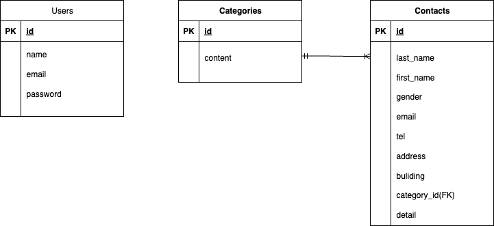

# お問い合わせフォーム

## 環境構築

### Dockerビルド
1. リポジトリをクローン
   ```bash
   git clone https://github.com/sametyan9999/test-contactform1.git
   cd test-contactform1
2. コンテナをビルド・起動
   docker-compose up -d --build

※ MySQL が OS によって起動しない場合があるので、それぞれのPCに合わせて docker-compose.yml を編集してください。

### Laravel環境構築
1. PHPコンテナに入る
docker-compose exec php bash

2. 依存関係をインストール
composer install

3. .env のDB設定を修正
DB_CONNECTION=mysql
DB_HOST=mysql
DB_PORT=3306
DB_DATABASE=laravel_db
DB_USERNAME=laravel_user
DB_PASSWORD=laravel_pass

4. アプリケーションキーを生成
php artisan key:generate

5. マイグレーションを実行
php artisan migrate

6. シーディングを実行
php artisan db:seed


## 使用技術(実行環境)
•	PHP 8.1
•	Laravel 8.x
•	MySQL 8.0
•	Docker / Docker Compose
•	phpMyAdmin
•	Laravel Fortify（認証機能）

## ER図


## URL
•	開発環境: http://localhost
•	phpMyAdmin: http://localhost:8080